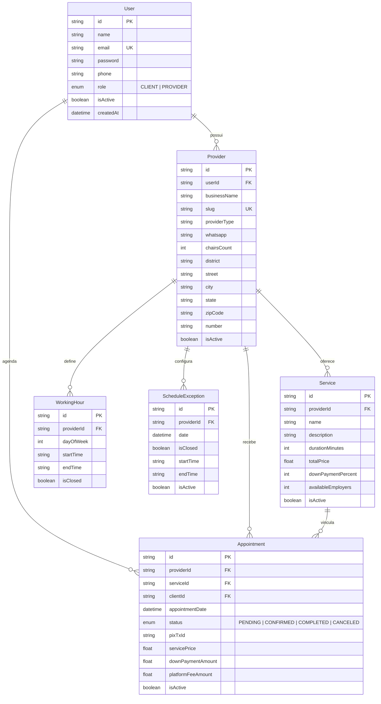

<div align="center">

# 🟢 SinalizeGO API

     

**Plataforma de agendamento inteligente para prestadores de serviços**

*Conectando clientes aos melhores profissionais da sua região* ✨

---

[📖 Documentação](#-documentação-da-api) · [🚀 Começando](#-começando) · [📦 Módulos](#-módulos) · [🗄️ Banco de Dados](#️-banco-de-dados)

</div>

---

## 📋 Sobre o Projeto

**SinalizeGO** é uma API RESTful robusta para gerenciamento de agendamentos entre **clientes** e **prestadores de serviços** (barbearias, estúdios, salões e mais). A plataforma permite que prestadores cadastrem seus negócios, definam serviços com preços e duração, e recebam agendamentos com controle de pagamento via Pix.

### ✨ Destaques

| Recurso | Descrição |
|---------|-----------|
| 🔐 **Autenticação JWT** | Login seguro com access token + refresh token |
| 👥 **Gestão de Usuários** | Cadastro com validação e hash de senha (bcrypt) |
| 🏪 **Perfil de Negócio** | Criação de perfil com slug automático e endereço completo |
| 💈 **Catálogo de Serviços** | CRUD completo com cálculo automático de taxa da plataforma |
| 📅 **Agendamentos** | Sistema com status de pagamento e soft delete |
| 📖 **Swagger UI** | Documentação interativa em `/api` |
| 🛡️ **Soft Delete** | Desativação segura sem perda de dados |

---

## 🚀 Começando

### Pré-requisitos

```
Node.js >= 18
PostgreSQL (Supabase)
npm ou yarn
```

### Instalação

```bash
# 1️⃣ Clone o repositório
git clone https://github.com/copperlamb78/api-sinalizego.git
cd api-sinalizego

# 2️⃣ Instale as dependências
npm install

# 3️⃣ Configure as variáveis de ambiente
cp .env.example .env
# Edite o .env com suas credenciais

# 4️⃣ Gere o Prisma Client
npx prisma generate

# 5️⃣ Execute as migrations
npx prisma migrate deploy

# 6️⃣ Inicie o servidor
npm run start:dev
```

### ⚙️ Variáveis de Ambiente

```env
PORT=7878

# Conexão com Supabase PostgreSQL (pooler - transações)
DATABASE_URL="postgresql://..."

# Conexão direta (migrations)
DIRECT_URL="postgresql://..."
```

### 🏃 Scripts Disponíveis

| Comando | Descrição |
|---------|-----------|
| `npm run start:dev` | 🔄 Inicia em modo watch (desenvolvimento) |
| `npm run start:debug` | 🐛 Inicia em modo debug com watch |
| `npm run build` | 📦 Compila para produção |
| `npm run start:prod` | 🚀 Inicia build de produção |
| `npm run lint` | 🔍 Executa o linter (ESLint) |
| `npm run format` | 🎨 Formata o código (Prettier) |
| `npm run test` | 🧪 Executa os testes |

---

## 📦 Módulos

### 🔐 Auth — Autenticação

> Gerenciamento de login com JWT (access + refresh token) via Supabase Auth.

| Método | Rota | Descrição | Auth |
|--------|------|-----------|------|
| `POST` | `/auth/login` | Login com email e senha | ❌ |
| `POST` | `/auth/refresh` | Renovar access token | 🔑 Refresh Token |

<details>
<summary>📝 <b>Body — Login</b></summary>

```json
{
  "email": "usuario@email.com",
  "password": "senha123"
}
```
</details>

<details>
<summary>✅ <b>Response — Login (201)</b></summary>

```json
{
  "access_token": "eyJhbGciOiJIUzI1NiIs...",
  "refresh_token": "v1.MjQ1NjM4..."
}
```
</details>

---

### 👥 Users — Usuários

> Cadastro e gestão de usuários da plataforma.

| Método | Rota | Descrição | Auth |
|--------|------|-----------|------|
| `POST` | `/users` | Criar novo usuário | ❌ |

<details>
<summary>📝 <b>Body — Criar Usuário</b></summary>

```json
{
  "name": "João Silva",
  "email": "joao@email.com",
  "password": "senhaSegura123",
  "phone": "75999999999"
}
```
</details>

---

### 🏪 Providers — Prestadores

> Cadastro de negócios com geração automática de slug para URL amigável.

| Método | Rota | Descrição | Auth |
|--------|------|-----------|------|
| `POST` | `/providers` | Criar prestador de serviço | ❌ |
| `GET` | `/providers/get-by-user-id` | Buscar prestador por userId | 🔑 JWT |
| `GET` | `/providers/get-all` | Listar todos os prestadores | ❌ |

<details>
<summary>📝 <b>Body — Criar Prestador</b></summary>

```json
{
  "userId": "uuid-do-usuario",
  "businessName": "Barber's Shop",
  "providerType": "Barbearia",
  "district": "Centro",
  "street": "Rua das Flores",
  "city": "Feira de Santana",
  "state": "Bahia",
  "zipCode": "44085370",
  "number": "123",
  "whatsapp": "75999999999",
  "password": "senhaSegura123"
}
```
</details>

<details>
<summary>✅ <b>Response — Criar Prestador (201)</b></summary>

```json
{
  "provider": {
    "id": "uuid",
    "businessName": "Barber's Shop",
    "slug": "barbers-shop",
    "providerType": "Barbearia",
    "whatsapp": "75999999999",
    "isActive": true
  }
}
```
</details>

---

### 💈 Providers-Service — Serviços do Prestador

> CRUD completo de serviços com cálculo automático de taxa da plataforma (10%).

| Método | Rota | Descrição | Auth |
|--------|------|-----------|------|
| `POST` | `/providers-service/create` | Criar serviço | 🔑 JWT |
| `GET` | `/providers-service/list` | Listar serviços do prestador logado | 🔑 JWT |
| `GET` | `/providers-service/list/:slug` | Listar serviços por slug (público) | ❌ |
| `PATCH` | `/providers-service/update/:serviceId` | Atualizar serviço | 🔑 JWT |
| `DELETE` | `/providers-service/deactivate/:serviceId` | Desativar serviço (soft delete) | 🔑 JWT |

<details>
<summary>📝 <b>Body — Criar Serviço</b></summary>

```json
{
  "name": "Corte de Cabelo",
  "description": "Corte masculino completo",
  "durationMinutes": 60,
  "totalPrice": 50.00,
  "downPaymentPercent": 10,
  "availableEmployers": 2
}
```
</details>

---

## 🗄️ Banco de Dados

### Diagrama de Entidades



---

## 🏗️ Arquitetura do Projeto

```
src/
├── 📄 main.ts                          # Bootstrap + Swagger
├── 📄 app.module.ts                    # Módulo raiz
├── 📄 app.controller.ts               # Controller padrão
├── 📄 app.service.ts                   # Service padrão
│
├── 🗄️ prisma/
│   ├── prisma.module.ts                # Módulo global do Prisma
│   └── prisma.service.ts              # Conexão via Driver Adapter (pg)
│
└── 📦 modules/
    ├── 🔐 auth/
    │   ├── auth.module.ts
    │   ├── auth.controller.ts
    │   ├── auth.service.ts
    │   ├── dto/
    │   │   └── user-login.dto.ts
    │   └── jwt/
    │       ├── guard/
    │       │   ├── jwt-auth.guard.ts
    │       │   └── jwt-refresh.guard.ts
    │       └── strategy/
    │           ├── jwt.strategy.ts
    │           └── jwt-refresh.strategy.ts
    │
    ├── 👥 users/
    │   ├── users.module.ts
    │   ├── users.controller.ts
    │   ├── users.service.ts
    │   └── dto/
    │       └── user-create.dto.ts
    │
    ├── 🏪 providers/
    │   ├── providers.module.ts
    │   ├── providers.controller.ts
    │   ├── providers.service.ts
    │   ├── dto/
    │   │   └── providers-create.dto.ts
    │   └── helpers/
    │       └── create-slug.helper.ts
    │
    └── 💈 providers-service/
        ├── providers-service.module.ts
        ├── providers-service.controller.ts
        ├── providers-service.service.ts
        ├── dto/
        │   ├── create-service.dto.ts
        │   ├── list-service.dto.ts
        │   └── update-service.dto.ts
        └── helpers/
            └── calculate-tax.helper.ts
```

---

## 🛠️ Stack Tecnológica

<div align="center">

| Camada | Tecnologia | Versão |
|--------|------------|--------|
| ⚙️ **Runtime** | Node.js | >= 18 |
| 🏗️ **Framework** | NestJS | 11.x |
| 🔷 **Linguagem** | TypeScript | 5.x |
| 🗄️ **ORM** | Prisma | 7.8 |
| 🐘 **Banco de Dados** | PostgreSQL (Supabase) | 15.x |
| 🔐 **Autenticação** | JWT + Supabase Auth | — |
| 📖 **Documentação** | Swagger / OpenAPI | 11.x |
| ✅ **Validação** | class-validator | 0.15 |

</div>

---

## 📖 Documentação da API

Com o servidor rodando, acesse a documentação interativa do Swagger:

```
http://localhost:3000/api
```

---

## 📄 Licença

Este projeto está sob a licença **UNLICENSED** — uso privado.

---

<div align="center">

**Feito com ❤️ para o SinalizeGO**


</div>
