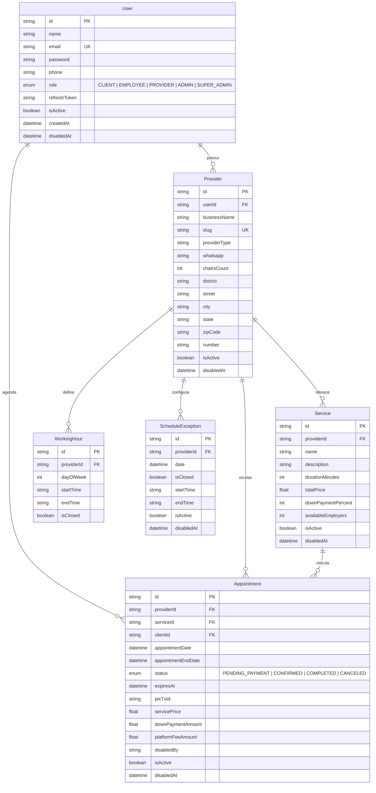

<div align="center">

# 🟢 SinalizeGO API

     

**Plataforma de agendamento inteligente para prestadores de serviços**

*Conectando clientes aos melhores profissionais da sua região* ✨

---

[📖 Documentação](#-documentação-da-api) · [🚀 Começando](#-começando) · [📦 Módulos](#-módulos) · [🗄️ Banco de Dados](#️-banco-de-dados) · [🔑 Permissões](#-sistema-de-permissões)

</div>

---

## 📋 Sobre o Projeto

**SinalizeGO** é uma API RESTful robusta para gerenciamento de agendamentos entre **clientes** e **prestadores de serviços** (barbearias, estúdios, salões e mais). A plataforma permite que prestadores cadastrem seus negócios, definam serviços com preços e duração, e recebam agendamentos com controle de pagamento via Pix.

### ✨ Destaques

| Recurso | Descrição |
|---------|-----------|
| 🔐 **Autenticação JWT** | Login seguro com access token + refresh token |
| 🔑 **RBAC (Role-Based Access Control)** | 5 níveis de permissão com guard customizado |
| 👥 **Gestão de Usuários** | CRUD completo com ativação/desativação e hash de senha |
| 🏪 **Perfil de Negócio** | Criação com slug automático, filtros, ordenação e ativação |
| 💈 **Catálogo de Serviços** | CRUD completo com taxa da plataforma e ativação |
| 📅 **Agendamentos** | Criação com verificação de conflitos, filtros por role e cancelamento |
| 💳 **Transações** | Módulo preparado para integração com pagamentos |
| 📖 **Swagger UI** | Documentação interativa em `/api` |
| 🛡️ **Soft Delete** | Desativação segura com rastreamento de quem desativou |

---

## 🚀 Começando

### Pré-requisitos

```
Node.js >= 18
PostgreSQL (Supabase)
npm ou yarn
```

### Instalação

```bash
# 1️⃣ Clone o repositório
git clone https://github.com/copperlamb78/api-sinalizego.git
cd api-sinalizego

# 2️⃣ Instale as dependências
npm install

# 3️⃣ Configure as variáveis de ambiente
cp .env.example .env
# Edite o .env com suas credenciais

# 4️⃣ Gere o Prisma Client
npx prisma generate

# 5️⃣ Execute as migrations
npx prisma migrate deploy

# 6️⃣ Inicie o servidor
npm run start:dev
```

### ⚙️ Variáveis de Ambiente

```env
PORT=7878

# Conexão com Supabase PostgreSQL (pooler - transações)
DATABASE_URL="postgresql://..."

# Conexão direta (migrations)
DIRECT_URL="postgresql://..."

# JWT
JWT_SECRET="sua-chave-secreta"
JWT_REFRESH_SECRET="sua-chave-refresh-secreta"
```

### 🏃 Scripts Disponíveis

| Comando | Descrição |
|---------|-----------|
| `npm run start:dev` | 🔄 Inicia em modo watch (desenvolvimento) |
| `npm run start:debug` | 🐛 Inicia em modo debug com watch |
| `npm run build` | 📦 Compila para produção |
| `npm run start:prod` | 🚀 Inicia build de produção |
| `npm run lint` | 🔍 Executa o linter (ESLint) |
| `npm run format` | 🎨 Formata o código (Prettier) |
| `npm run test` | 🧪 Executa os testes |

---

## 🔑 Sistema de Permissões

A API utiliza **RBAC (Role-Based Access Control)** com 5 níveis de permissão e grupos predefinidos.

### Roles

| Role | Descrição |
|------|-----------|
| `CLIENT` | Usuário padrão que agenda serviços |
| `EMPLOYEE` | Funcionário de um prestador |
| `PROVIDER` | Dono de negócio / prestador de serviço |
| `ADMIN` | Administrador do sistema |
| `SUPER_ADMIN` | Administrador com acesso total |

### Grupos de Permissão

| Grupo | Roles incluídas | Uso |
|-------|-----------------|-----|
| `SYSTEM_MANAGERS` | ADMIN, SUPER_ADMIN | Gestão do sistema (listar usuários) |
| `INTERNAL_USERS` | EMPLOYEE, PROVIDER, ADMIN, SUPER_ADMIN | Operações internas |
| `INTERNAL_NO_EMPLOYEE` | PROVIDER, ADMIN, SUPER_ADMIN | Operações sem funcionário (desativar/ativar) |
| `ALL_USERS` | CLIENT, EMPLOYEE, PROVIDER, ADMIN, SUPER_ADMIN | Acesso geral autenticado |

---

## 📦 Módulos

### 🔐 Auth — Autenticação

> Gerenciamento de login com JWT (access token de 15min + refresh token de 30 dias).

| Método | Rota | Descrição | Auth | Roles |
|--------|------|-----------|------|-------|
| `POST` | `/auth/login` | Login com email e senha | ❌ | — |
| `POST` | `/auth/refresh` | Renovar access token | 🔑 Refresh | — |

<details>
<summary>📝 <b>Body — Login</b></summary>

```json
{
  "email": "usuario@email.com",
  "password": "senha123"
}
```
</details>

<details>
<summary>✅ <b>Response — Login (201)</b></summary>

```json
{
  "access_token": "eyJhbGciOiJIUzI1NiIs...",
  "refresh_token": "v1.MjQ1NjM4...",
  "user": {
    "id": "uuid",
    "name": "João Silva",
    "email": "joao@email.com",
    "role": "CLIENT"
  }
}
```
</details>

---

### 👥 Users — Usuários

> CRUD completo com validação, hash de senha (bcrypt), ativação/desativação e controle de acesso por roles.

| Método | Rota | Descrição | Auth | Roles |
|--------|------|-----------|------|-------|
| `POST` | `/users/create` | Criar novo usuário | ❌ | — |
| `GET` | `/users/list` | Listar todos os usuários | 🔑 JWT | `SYSTEM_MANAGERS` |
| `PATCH` | `/users/update/:userId` | Atualizar dados do usuário | 🔑 JWT | — |
| `DELETE` | `/users/deactivate/:userId` | Desativar usuário (soft delete) | 🔑 JWT | `INTERNAL_NO_EMPLOYEE` |
| `PATCH` | `/users/activate/:userId` | Reativar usuário | 🔑 JWT | `INTERNAL_NO_EMPLOYEE` |

<details>
<summary>📝 <b>Body — Criar Usuário</b></summary>

```json
{
  "name": "João Silva",
  "email": "joao@email.com",
  "password": "senhaSegura123",
  "phone": "75999999999"
}
```
</details>

---

### 🏪 Providers — Prestadores

> Cadastro de negócios com slug automático, filtros, ativação/desativação e busca por ID.

| Método | Rota | Descrição | Auth | Roles |
|--------|------|-----------|------|-------|
| `POST` | `/providers/create` | Criar prestador (com novo usuário) | ❌ | — |
| `POST` | `/providers/create-to-user` | Criar negócio para usuário existente | 🔑 JWT | — |
| `GET` | `/providers/get-by-user-id` | Buscar prestador por userId | 🔑 JWT | — |
| `GET` | `/providers/get-by-id/:providerId` | Buscar prestador por ID | 🔑 JWT | `INTERNAL_USERS` |
| `GET` | `/providers/list` | Listar prestadores do usuário (com filtros) | 🔑 JWT | — |
| `GET` | `/providers/get-all` | Listar todos os prestadores | ❌ | — |
| `PATCH` | `/providers/activate/:providerId` | Reativar negócio | 🔑 JWT | `INTERNAL_NO_EMPLOYEE` |

<details>
<summary>📝 <b>Body — Criar Negócio (usuário existente)</b></summary>

```json
{
  "businessName": "Barber's Shop",
  "providerType": "Barbearia",
  "phone": "75999999999",
  "district": "Centro",
  "street": "Rua das Flores",
  "city": "Feira de Santana",
  "state": "Bahia",
  "zipCode": "44085370",
  "number": "123"
}
```
</details>

<details>
<summary>🔍 <b>Query Params — Filtros (GET /providers/list)</b></summary>

| Parâmetro | Tipo | Descrição |
|-----------|------|-----------|
| `businessName` | `string` | Filtrar por nome do negócio |
| `providerType` | `string` | Filtrar por tipo (ex: Barbearia) |
| `orderBy` | `asc \| desc` | Ordenar por data de criação |

```
GET /providers/list?providerType=Barbearia&orderBy=desc
```
</details>

---

### 💈 Providers-Service — Serviços do Prestador

> CRUD completo de serviços com taxa da plataforma, ativação e controle de acesso.

| Método | Rota | Descrição | Auth | Roles |
|--------|------|-----------|------|-------|
| `POST` | `/providers-service/create` | Criar serviço | 🔑 JWT | `INTERNAL_NO_EMPLOYEE` |
| `GET` | `/providers-service/list` | Listar serviços do prestador logado | 🔑 JWT | `INTERNAL_USERS` |
| `GET` | `/providers-service/list/:slug` | Listar serviços por slug (vitrine pública) | ❌ | — |
| `PATCH` | `/providers-service/update/:serviceId` | Atualizar serviço | 🔑 JWT | `INTERNAL_NO_EMPLOYEE` |
| `DELETE` | `/providers-service/deactivate/:serviceId` | Desativar serviço (soft delete) | 🔑 JWT | `INTERNAL_NO_EMPLOYEE` |
| `PATCH` | `/providers-service/activate/:serviceId` | Reativar serviço | 🔑 JWT | `INTERNAL_NO_EMPLOYEE` |

<details>
<summary>📝 <b>Body — Criar Serviço</b></summary>

```json
{
  "name": "Corte de Cabelo",
  "description": "Corte masculino completo",
  "durationMinutes": 60,
  "totalPrice": 50.00,
  "downPaymentPercent": 10,
  "availableEmployers": 2
}
```
</details>

<details>
<summary>💰 <b>Taxa da Plataforma (automática)</b></summary>

| Preço do Serviço | Taxa |
|------------------|------|
| Até R$ 50,00 | 15% |
| R$ 50,01 — R$ 249,99 | 10% |
| R$ 250,00+ | 5% |

</details>

---

### 📅 Appointments — Agendamentos

> Criação com verificação de disponibilidade, filtros por role, cancelamento e controle de acesso.

| Método | Rota | Descrição | Auth | Roles |
|--------|------|-----------|------|-------|
| `POST` | `/appointments` | Criar agendamento | 🔑 JWT | — |
| `GET` | `/appointments/list` | Listar agendamentos (filtros por role do usuário) | 🔑 JWT | — |
| `GET` | `/appointments/list-all` | Listar todos os agendamentos (super admin) | 🔑 JWT | `SYSTEM_MANAGERS` |
| `PATCH` | `/appointments/cancel/:appointmentId` | Cancelar agendamento | 🔑 JWT | — |

<details>
<summary>📝 <b>Body — Criar Agendamento</b></summary>

```json
{
  "providerId": "uuid-do-prestador",
  "serviceId": "uuid-do-servico",
  "appointmentDate": "2026-07-25T14:00:00.000Z"
}
```
</details>

<details>
<summary>⚙️ <b>Lógica de Negócio</b></summary>

- ✅ Verifica se o prestador e serviço existem
- ✅ Calcula `appointmentEndDate` com base na duração do serviço
- ✅ Verifica conflitos de horário (mesmo prestador, mesmo período)
- ✅ Verifica vagas disponíveis (`availableEmployers`)
- ✅ Calcula `servicePrice`, `downPaymentAmount` e `platformFeeAmount` automaticamente
- ✅ Define `expiresAt` (15 min para confirmar pagamento)
- ✅ Status inicial: `PENDING_PAYMENT`

</details>

<details>
<summary>🔍 <b>Filtros por Role na Listagem</b></summary>

| Role | Filtros disponíveis |
|------|---------------------|
| **CLIENT** | `serviceId`, `startDate`, `orderBy` |
| **PROVIDER / EMPLOYEE** | `clientId`, `serviceId`, `status`, `startDate`, `endDate`, `servicePrice`, `downPaymentAmount`, `isActive`, `orderBy` |
| **SUPER_ADMIN** | Todos os filtros acima + `providerId`, `platformFeeAmount` |

</details>

---

### 💳 Transactions — Transações

> Módulo base preparado para integração com sistema de pagamentos (Pix).

| Método | Rota | Descrição | Auth |
|--------|------|-----------|------|
| — | `/transactions` | *Em desenvolvimento* | — |

---

## 🗄️ Banco de Dados

### Diagrama de Entidades



---

## 🏗️ Arquitetura do Projeto

```
src/
├── 📄 main.ts                          # Bootstrap + Swagger
├── 📄 app.module.ts                    # Módulo raiz
├── 📄 app.controller.ts               # Controller padrão
├── 📄 app.service.ts                   # Service padrão
│
├── 🧰 helpers/
│   └── calculate-tax.helper.ts        # Cálculo de taxa da plataforma
│
├── 📋 common/
│   └── constants/
│       └── role-groups.constant.ts    # Grupos de roles (SYSTEM_MANAGERS, etc.)
│
├── 🗄️ prisma/
│   ├── prisma.module.ts                # Módulo global do Prisma
│   └── prisma.service.ts              # Conexão via Driver Adapter (pg)
│
└── 📦 modules/
    ├── 🔐 auth/
    │   ├── auth.module.ts
    │   ├── auth.controller.ts
    │   ├── auth.service.ts
    │   ├── dto/
    │   │   └── user-login.dto.ts
    │   ├── jwt/
    │   │   ├── guard/
    │   │   │   ├── jwt-auth.guard.ts
    │   │   │   └── jwt-refresh.guard.ts
    │   │   └── strategy/
    │   │       ├── jwt.strategy.ts
    │   │       └── jwt-refresh.strategy.ts
    │   └── roles/
    │       ├── decorators/
    │       │   └── roles.decorator.ts
    │       └── guard/
    │           └── roles.guard.ts
    │
    ├── 👥 users/
    │   ├── users.module.ts
    │   ├── users.controller.ts
    │   ├── users.service.ts
    │   └── dto/
    │       ├── user-create.dto.ts
    │       └── user-update.dto.ts
    │
    ├── 🏪 providers/
    │   ├── providers.module.ts
    │   ├── providers.controller.ts
    │   ├── providers.service.ts
    │   ├── dto/
    │   │   ├── providers-create.dto.ts
    │   │   └── providers-filter.dto.ts
    │   └── helpers/
    │       └── create-slug.helper.ts
    │
    ├── 💈 providers-service/
    │   ├── providers-service.module.ts
    │   ├── providers-service.controller.ts
    │   ├── providers-service.service.ts
    │   └── dto/
    │       ├── create-service.dto.ts
    │       ├── list-service.dto.ts
    │       └── update-service.dto.ts
    │
    ├── 📅 appointments/
    │   ├── appointments.module.ts
    │   ├── appointments.controller.ts
    │   ├── appointments.service.ts
    │   └── dto/
    │       ├── appointments-create.dto.ts
    │       ├── appointements-update.dto.ts
    │       ├── appointments-deactivate.dto.ts
    │       └── appointments-filters.dto.ts
    │
    └── 💳 transactions/
        ├── transactions.module.ts
        ├── transactions.controller.ts
        ├── transactions.service.ts
        └── dto/
            └── transactions-create.dto.ts
```

---

## 🛠️ Stack Tecnológica

<div align="center">

| Camada | Tecnologia | Versão |
|--------|------------|--------|
| ⚙️ **Runtime** | Node.js | >= 18 |
| 🏗️ **Framework** | NestJS | 11.x |
| 🔷 **Linguagem** | TypeScript | 5.x |
| 🗄️ **ORM** | Prisma | 7.8 |
| 🐘 **Banco de Dados** | PostgreSQL (Supabase) | 15.x |
| 🔐 **Autenticação** | JWT + Passport | — |
| 🔒 **Hash** | bcrypt | 6.x |
| 📖 **Documentação** | Swagger / OpenAPI | 11.x |
| ✅ **Validação** | class-validator | 0.15 |

</div>

---

## 📖 Documentação da API

Com o servidor rodando, acesse a documentação interativa do Swagger:

```
http://localhost:7878/api
```

---

## 📄 Licença

Este projeto está sob a licença **UNLICENSED** — uso privado.

---

<div align="center">

**Feito com ❤️ para o SinalizeGO**


</div>
