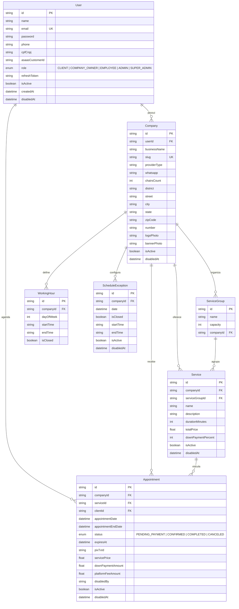

<div align="center">

# 🟢 SinalizeGO API

     

**Plataforma de agendamento inteligente para empresas e prestadores de serviços**

*Conectando clientes às melhores empresas da sua região* ✨

---

[📖 Documentação](#-documentação-da-api) · [🚀 Começando](#-começando) · [📦 Módulos](#-módulos) · [🗄️ Banco de Dados](#️-banco-de-dados) · [🔑 Permissões](#-sistema-de-permissões)

</div>

---

## 📋 Sobre o Projeto

**SinalizeGO** é uma API RESTful robusta para gerenciamento de agendamentos entre **clientes** e **empresas/prestadores de serviços** (barbearias, estúdios, salões e mais). A plataforma permite que donos de empresa cadastrem seus negócios (`Company`), criem subcontas financeiras no Asaas Sandbox com split de pagamentos via Pix, organizem serviços em grupos de atendimento (`ServiceGroup`) com limite de capacidade, e recebam agendamentos com confirmação em tempo real via Webhook.

### ✨ Destaques

| Recurso | Descrição |
|---------|-----------|
| 🔐 **Autenticação JWT** | Login seguro com access token + refresh token |
| 🔑 **RBAC (Role-Based Access Control)** | Níveis de permissão com guard customizado (CLIENT, COMPANY_OWNER, EMPLOYEE, ADMIN, SUPER_ADMIN) |
| 👥 **Gestão de Usuários** | CRUD completo com atualização de CPF/CNPJ e vinculo automático de Customer ID no Asaas |
| 🏢 **Perfil da Empresa (Company)** | Criação com slug automático, filtros, ordenação e ativação |
| 📁 **Grupos de Serviços (ServiceGroup)** | Organização de serviços por grupos com limite de capacidade de atendimento simultâneo |
| 💈 **Catálogo de Serviços** | CRUD completo por empresa com vinculo ao grupo de serviços e taxa da plataforma |
| 📅 **Agendamentos** | Criação com verificação de vagas por capacidade do grupo e expiração de reserva |
| 💳 **Perfil Financeiro & Split (Asaas)** | Criação de subcontas no Asaas Sandbox e cobranças Pix com split para a carteira da empresa |
| ⚡ **Webhooks em Tempo Real** | Processamento automático dos eventos `PAYMENT_CONFIRMED` e `PAYMENT_RECEIVED` para aprovar agendamentos |
| 📖 **Swagger UI** | Documentação interativa em `/api` |
| 🛡️ **Soft Delete** | Desativação segura com rastreamento de quem desativou |

---

## 🚀 Começando

### Pré-requisitos

```
Node.js >= 18
PostgreSQL (Supabase)
npm ou yarn
```

### Instalação

```bash
# 1️⃣ Clone o repositório
git clone https://github.com/copperlamb78/api-sinalizego.git
cd api-sinalizego

# 2️⃣ Instale as dependências
npm install

# 3️⃣ Configure as variáveis de ambiente
cp .env.example .env
# Edite o .env com suas credenciais (DATABASE_URL, JWT_SECRET, ASAAS_API_KEY, etc.)

# 4️⃣ Gere o Prisma Client
npx prisma generate

# 5️⃣ Execute as migrations
npx prisma migrate deploy

# 6️⃣ Inicie o servidor
npm run start:dev
```

### ⚙️ Variáveis de Ambiente

```env
PORT=3000

# Conexão com Supabase PostgreSQL
DATABASE_URL="postgresql://..."
DIRECT_URL="postgresql://..."

# JWT
JWT_SECRET="sua-chave-secreta"
JWT_REFRESH_SECRET="sua-chave-refresh-secreta"

# Asaas Sandbox Integration
ASAAS_API_URL="https://sandbox.asaas.com/api/v3"
ASAAS_API_KEY="$aact_YTU5YTE0M2..."
ASAAS_WEBHOOK_SECRET="seu-token-webhook"
```

### 🏃 Scripts Disponíveis

| Comando | Descrição |
|---------|-----------|
| `npm run start:dev` | 🔄 Inicia em modo watch (desenvolvimento) |
| `npm run start:debug` | 🐛 Inicia em modo debug com watch |
| `npm run build` | 📦 Compila para produção |
| `npm run start:prod` | 🚀 Inicia build de produção |
| `npm run lint` | 🔍 Executa o linter (ESLint) |
| `npm run format` | 🎨 Formata o código (Prettier) |
| `npm run test` | 🧪 Executa os testes |

---

## 🔑 Sistema de Permissões

A API utiliza **RBAC (Role-Based Access Control)** com níveis de permissão e grupos predefinidos.

### Roles

| Role | Descrição |
|------|-----------|
| `CLIENT` | Usuário padrão que agenda serviços |
| `COMPANY_OWNER` | Dono de empresa / negócio |
| `EMPLOYEE` | Funcionário de uma empresa |
| `ADMIN` | Administrador do sistema |
| `SUPER_ADMIN` | Administrador com acesso total |

### Grupos de Permissão

| Grupo | Roles incluídas | Uso |
|-------|-----------------|-----|
| `SYSTEM_MANAGERS` | ADMIN, SUPER_ADMIN | Gestão do sistema (listar usuários, listagens globais) |
| `INTERNAL_USERS` | COMPANY_OWNER, EMPLOYEE, ADMIN, SUPER_ADMIN | Operações internas de consulta |
| `INTERNAL_NO_EMPLOYEE` | COMPANY_OWNER, ADMIN, SUPER_ADMIN | Operações administrativas sem funcionário (criação/alteração) |
| `ALL_USERS` | CLIENT, COMPANY_OWNER, EMPLOYEE, ADMIN, SUPER_ADMIN | Acesso geral autenticado |

---

## 📦 Módulos

### 🔐 Auth — Autenticação

> Gerenciamento de login com JWT (access token de 15min + refresh token de 30 dias).

| Método | Rota | Descrição | Auth | Roles |
|--------|------|-----------|------|-------|
| `POST` | `/auth/login` | Login com email e senha | ❌ | — |
| `POST` | `/auth/refresh` | Renovar access token | 🔑 Refresh | — |
| `GET` | `/auth/me` | Dados do usuário logado | 🔑 Refresh | — |
| `POST` | `/auth/logout` | Encerrar sessão | 🔑 Refresh | — |

---

### 👥 Users — Usuários

> CRUD completo com validação, hash de senha (bcrypt), ativação/desativação e controle de acesso por roles.

| Método | Rota | Descrição | Auth | Roles |
|--------|------|-----------|------|-------|
| `POST` | `/users/create` | Criar novo usuário | ❌ | — |
| `GET` | `/users/list` | Listar todos os usuários | 🔑 JWT | `SYSTEM_MANAGERS` |
| `PATCH` | `/users/update/:userId` | Atualizar dados do usuário | 🔑 JWT | — |
| `PATCH` | `/users/update-cpf` | Atualizar CPF/CNPJ e gerar Customer ID Asaas | 🔑 JWT | — |
| `DELETE` | `/users/deactivate/:userId` | Desativar usuário (soft delete) | 🔑 JWT | `INTERNAL_NO_EMPLOYEE` |
| `PATCH` | `/users/activate/:userId` | Reativar usuário | 🔑 JWT | `INTERNAL_NO_EMPLOYEE` |

---

### 🏢 Company — Empresas

> Cadastro de empresas com slug automático, busca por ID, filtros, ordenação e ativação/desativação.

| Método | Rota | Descrição | Auth | Roles |
|--------|------|-----------|------|-------|
| `POST` | `/company/create` | Criar empresa (com novo usuário) | ❌ | — |
| `POST` | `/company/create-company-to-user` | Criar empresa para usuário existente | 🔑 JWT | — |
| `GET` | `/company/get-by-user-id` | Buscar empresa por userId | 🔑 JWT | `INTERNAL_NO_EMPLOYEE` |
| `GET` | `/company/get-by-id/:companyId` | Buscar empresa por ID | 🔑 JWT | `INTERNAL_USERS` |
| `GET` | `/company/list` | Listar empresas do usuário (com filtros) | 🔑 JWT | `INTERNAL_NO_EMPLOYEE` |
| `GET` | `/company/get-all` | Listar todas as empresas | 🔑 JWT | `SYSTEM_MANAGERS` |
| `GET` | `/company/get-by-slug/:slug` | Buscar empresa por slug (público) | ❌ | — |
| `PATCH` | `/company/update/:companyId` | Atualizar empresa | 🔑 JWT | `INTERNAL_NO_EMPLOYEE` |
| `DELETE` | `/company/deactivate/:companyId` | Desativar empresa | 🔑 JWT | `INTERNAL_NO_EMPLOYEE` |
| `PATCH` | `/company/activate/:companyId` | Reativar empresa | 🔑 JWT | `INTERNAL_NO_EMPLOYEE` |

---

### 📁 Service-Group — Grupos de Serviços

> Gestão de grupos de serviços por empresa com definição de capacidade simultânea de atendimento.

| Método | Rota | Descrição | Auth | Roles |
|--------|------|-----------|------|-------|
| `POST` | `/service-group` | Criar novo grupo de serviços | 🔑 JWT | `INTERNAL_NO_EMPLOYEE` |
| `GET` | `/service-group` | Listar todos os grupos de serviços (com filtros) | 🔑 JWT | `INTERNAL_USERS` |
| `GET` | `/service-group/company/:companyId` | Listar grupos de serviços de uma empresa | 🔑 JWT | `INTERNAL_USERS` |
| `GET` | `/service-group/:id` | Buscar grupo de serviços por ID | 🔑 JWT | `INTERNAL_USERS` |
| `PATCH` | `/service-group/:id` | Atualizar grupo de serviços por ID | 🔑 JWT | `INTERNAL_NO_EMPLOYEE` |
| `PATCH` | `/service-group/company/:companyId/:id` | Atualizar grupo de serviços de uma empresa | 🔑 JWT | `INTERNAL_NO_EMPLOYEE` |
| `DELETE` | `/service-group/:id` | Remover grupo de serviços por ID | 🔑 JWT | `INTERNAL_NO_EMPLOYEE` |

---

### 💈 Company-Service — Serviços da Empresa

> CRUD completo de serviços por empresa vinculados a um grupo de serviços, com taxa da plataforma e vitrine pública.

| Método | Rota | Descrição | Auth | Roles |
|--------|------|-----------|------|-------|
| `POST` | `/company-service/create` | Criar serviço vinculado a um `serviceGroupId` | 🔑 JWT | `INTERNAL_NO_EMPLOYEE` |
| `GET` | `/company-service/list` | Listar serviços da empresa do usuário logado | 🔑 JWT | `INTERNAL_NO_EMPLOYEE` |
| `GET` | `/company-service/list/:slug` | Listar serviços por slug da empresa (vitrine pública) | ❌ | — |
| `PATCH` | `/company-service/update/:serviceId` | Atualizar serviço | 🔑 JWT | `INTERNAL_NO_EMPLOYEE` |
| `DELETE` | `/company-service/deactivate/:serviceId` | Desativar serviço | 🔑 JWT | `INTERNAL_NO_EMPLOYEE` |
| `PATCH` | `/company-service/activate/:serviceId` | Reativar serviço | 🔑 JWT | `INTERNAL_NO_EMPLOYEE` |
| `GET` | `/company-service/all` | Listar todos os serviços | 🔑 JWT | `SYSTEM_MANAGERS` |

<details>
<summary>💰 <b>Taxa da Plataforma (automática)</b></summary>

| Preço do Serviço | Taxa |
|------------------|------|
| Até R$ 50,00 | 15% |
| R$ 50,01 — R$ 249,99 | 10% |
| R$ 250,00+ | 5% |

</details>

---

### 📅 Appointments — Agendamentos

> Criação com verificação de vagas pela capacidade do grupo de serviços, cancelamento e controle de status.

| Método | Rota | Descrição | Auth | Roles |
|--------|------|-----------|------|-------|
| `POST` | `/appointments` | Criar agendamento (requer CPF cadastrado) | 🔑 JWT | — |
| `GET` | `/appointments` | Listar todos os agendamentos | 🔑 JWT | `SUPER_ADMIN` |
| `GET` | `/appointments/company` | Listar agendamentos da empresa | 🔑 JWT | `INTERNAL_USERS` |
| `GET` | `/appointments/user` | Listar agendamentos do cliente | 🔑 JWT | — |
| `PATCH` | `/appointments/:id/status` | Atualizar status do agendamento | 🔑 JWT | — |
| `DELETE` | `/appointments/:id/deactivate` | Cancelar/Desativar agendamento | 🔑 JWT | — |

---

### 💳 Financial Profile — Perfil Financeiro (Asaas)

> Gestão de subcontas financeiras no Asaas Sandbox para recebimento de pagamentos com split automatizado.

| Método | Rota | Descrição | Auth | Roles |
|--------|------|-----------|------|-------|
| `POST` | `/financial-profile/create` | Criar perfil financeiro (subconta Asaas) | 🔑 JWT | `INTERNAL_NO_EMPLOYEE` |
| `GET` | `/financial-profile/list` | Listar perfis do usuário logado (com filtros) | 🔑 JWT | `INTERNAL_NO_EMPLOYEE` |
| `GET` | `/financial-profile/user/:id` | Buscar perfil por ID pertencente ao usuário | 🔑 JWT | `INTERNAL_NO_EMPLOYEE` |
| `GET` | `/financial-profile/get-by-id/:id` | Buscar perfil por ID (dados sensíveis sanitizados) | 🔑 JWT | `INTERNAL_USERS` |
| `GET` | `/financial-profile/get-all` | Listar todos os perfis (Administração) | 🔑 JWT | `SYSTEM_MANAGERS` |
| `DELETE` | `/financial-profile/deactivate/:id` | Desativar perfil financeiro | 🔑 JWT | `INTERNAL_NO_EMPLOYEE` |
| `PATCH` | `/financial-profile/activate/:id` | Reativar perfil financeiro | 🔑 JWT | `INTERNAL_NO_EMPLOYEE` |

---

### 💳 Transactions & Webhooks — Transações e Webhooks Asaas

> Cobrança Pix com split automático para a carteira da empresa e atualização em tempo real via Webhook.

| Método | Rota | Descrição | Auth | Roles |
|--------|------|-----------|------|-------|
| `POST` | `/transactions/pix/:appointmentId` | Gerar ou recuperar cobrança Pix com split para a subconta Asaas | 🔑 JWT | — |
| `POST` | `/webhooks/asaas` | Receber notificações do Asaas (`PAYMENT_CONFIRMED`, `PAYMENT_RECEIVED`) | ❌ | Token Header |

---

## 🗄️ Banco de Dados

### Diagrama de Entidades


```mermaid
erDiagram
    User ||--o{ Company : "possui"
    User ||--o{ Appointment : "agenda"
    Company ||--o{ ServiceGroup : "organiza"
    Company ||--o{ Service : "oferece"
    Company ||--o{ Appointment : "recebe"
    Company ||--o{ WorkingHour : "define"
    Company ||--o{ ScheduleException : "configura"
    ServiceGroup ||--o{ Service : "agrupa"
    Service ||--o{ Appointment : "vincula"

    User {
        string id PK
        string name
        string email UK
        string password
        string phone
        string cpfCnpj
        string asaasCustomerId
        enum role "CLIENT | COMPANY_OWNER | EMPLOYEE | ADMIN | SUPER_ADMIN"
        string refreshToken
        boolean isActive
        datetime createdAt
        datetime disabledAt
    }

    Company {
        string id PK
        string userId FK
        string businessName
        string slug UK
        string providerType
        string whatsapp
        int chairsCount
        string district
        string street
        string city
        string state
        string zipCode
        string number
        string logoPhoto
        string bannerPhoto
        boolean isActive
        datetime disabledAt
    }

    ServiceGroup {
        string id PK
        string name
        int capacity
        string companyId FK
    }

    Service {
        string id PK
        string companyId FK
        string serviceGroupId FK
        string name
        string description
        int durationMinutes
        float totalPrice
        int downPaymentPercent
        boolean isActive
        datetime disabledAt
    }

    Appointment {
        string id PK
        string companyId FK
        string serviceId FK
        string clientId FK
        datetime appointmentDate
        datetime appointmentEndDate
        enum status "PENDING_PAYMENT | CONFIRMED | COMPLETED | CANCELED"
        datetime expiresAt
        string pixTxId
        float servicePrice
        float downPaymentAmount
        float platformFeeAmount
        string disabledBy
        boolean isActive
        datetime disabledAt
    }

    WorkingHour {
        string id PK
        string companyId FK
        int dayOfWeek
        string startTime
        string endTime
        boolean isClosed
    }

    ScheduleException {
        string id PK
        string companyId FK
        datetime date
        boolean isClosed
        string startTime
        string endTime
        boolean isActive
        datetime disabledAt
    }
```

---

## 🏗️ Arquitetura do Projeto

```
src/
├── 📄 main.ts                          # Bootstrap + Swagger + Global Exception Filters
├── 📄 app.module.ts                    # Módulo raiz
├── 📄 app.controller.ts               # Controller padrão
├── 📄 app.service.ts                   # Service padrão
│
├── 🧰 helpers/
│   └── calculate-tax.helper.ts        # Cálculo de taxa da plataforma
│
├── 📋 common/
│   ├── constants/
│   │   └── role-groups.constant.ts    # Grupos de roles (SYSTEM_MANAGERS, etc.)
│   └── filters/
│       └── prisma-client-exception.filter.ts # Filtro global de exceções Prisma
│
├── 💳 asaas/
│   ├── asaas.module.ts
│   ├── asaas.service.ts
│   └── webhook-asaas/
│       ├── webhooks.controller.ts
│       ├── webhooks.module.ts
│       └── webhooks.service.ts
│
├── ☁️ cloudinary/
│   ├── cloudinary.module.ts
│   ├── cloudinary.service.ts
│   └── upload/
│       ├── upload.controller.ts
│       └── upload.module.ts
│
├── 📁 service-group/
│   ├── service-group.module.ts
│   ├── service-group.controller.ts
│   ├── service-group.service.ts
│   └── dto/
│       ├── create-service-group.dto.ts
│       ├── filters-service-group.dto.ts
│       └── update-service-group.dto.ts
│
├── 🗄️ prisma/
│   ├── prisma.module.ts                # Módulo global do Prisma
│   └── prisma.service.ts              # Conexão via Driver Adapter (pg)
│
└── 📦 modules/
    ├── 🔐 auth/
    │   ├── auth.module.ts
    │   ├── auth.controller.ts
    │   ├── auth.service.ts
    │   └── roles/
    │       ├── decorators/
    │       │   └── roles.decorator.ts
    │       └── guard/
    │           └── roles.guard.ts
    │
    ├── 👥 users/
    │   ├── users.module.ts
    │   ├── users.controller.ts
    │   ├── users.service.ts
    │   └── dto/
    │       ├── user-create.dto.ts
    │       └── user-update.dto.ts
    │
    ├── 🏢 company/
    │   ├── company.module.ts
    │   ├── company.controller.ts
    │   ├── company.service.ts
    │   ├── dto/
    │   │   ├── company-create.dto.ts
    │   │   ├── company-filter.dto.ts
    │   │   └── company-update.dto.ts
    │   └── helpers/
    │       └── create-slug.helper.ts
    │
    ├── 💈 company-service/
    │   ├── company-service.module.ts
    │   ├── company-service.controller.ts
    │   ├── company-service.service.ts
    │   └── dto/
    │       ├── create-service.dto.ts
    │       ├── filter-service.dto.ts
    │       ├── list-service.dto.ts
    │       └── update-service.dto.ts
    │
    ├── 📅 appointments/
    │   ├── appointments.module.ts
    │   ├── appointments.controller.ts
    │   ├── appointments.service.ts
    │   └── dto/
    │       ├── appointments-create.dto.ts
    │       ├── appointements-update.dto.ts
    │       ├── appointments-deactivate.dto.ts
    │       └── appointments-filters.dto.ts
    │
    ├── 💳 financial-profile/
    │   ├── financial-profile.module.ts
    │   ├── financial-profile.controller.ts
    │   └── financial-profile.service.ts
    │
    └── 💳 transactions/
        ├── transactions.module.ts
        ├── transactions.controller.ts
        └── transactions.service.ts
```

---

## 🛠️ Stack Tecnológica

<div align="center">

| Camada | Tecnologia | Versão |
|--------|------------|--------|
| ⚙️ **Runtime** | Node.js | >= 18 |
| 🏗️ **Framework** | NestJS | 11.x |
| 🔷 **Linguagem** | TypeScript | 5.x |
| 🗄️ **ORM** | Prisma | 7.8 |
| 🐘 **Banco de Dados** | PostgreSQL (Supabase) | 15.x |
| 💳 **Gateway de Pagamento** | Asaas Sandbox API v3 | — |
| 🔐 **Autenticação** | JWT + Passport | — |
| 🔒 **Hash** | bcrypt | 6.x |
| ☁️ **Mídia** | Cloudinary | 2.x |
| 📖 **Documentação** | Swagger / OpenAPI | 11.x |
| ✅ **Validação** | class-validator | 0.15 |

</div>

---

## 📖 Documentação da API

Com o servidor rodando, acesse a documentação interativa do Swagger:

```
http://localhost:3000/api
```

---

## 📄 Licença

Este projeto está sob a licença **UNLICENSED** — uso privado.

---

<div align="center">

**Feito com ❤️ para o SinalizeGO**


</div>
